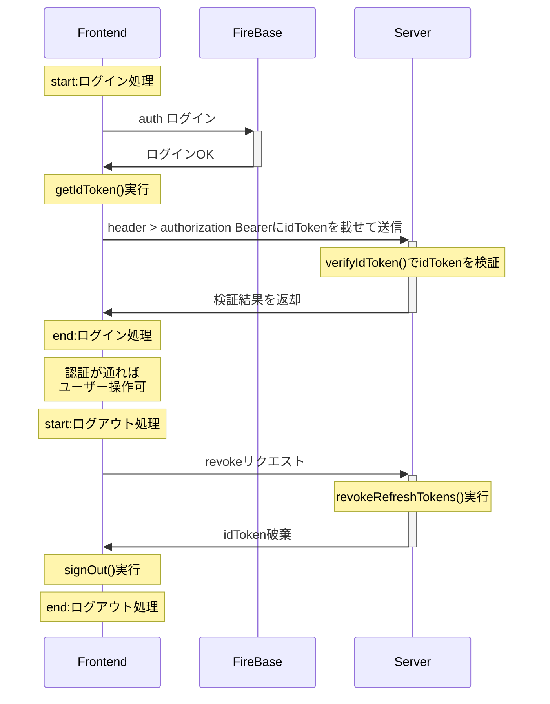

# j_template_firebase-functions

## 目次

- [概要](#概要)
- [推奨環境](#推奨環境)
- [コマンド一覧](#コマンド一覧)
- [フォルダ構成](#フォルダ構成)
- [クイックスタート](#クイックスタート)
- [NestJS x firebase cloud function のプロジェクトの作成方法](#NestJS_x_firebase_cloud_function_のプロジェクトの作成方法)
- [本テンプレートの使い方](#本テンプレートの使い方)
  - [認証](#認証)
  - [環境変数](#環境変数)
  - [Versioning](#Versioning)
  - [Firebase_Storage](#Firebase_Storage)
  - [タイムアウトとメモリーアロケーション](#タイムアウトとメモリーアロケーション)
  - [エイリアス](#エイリアス)
  - [エラーハンドリング](#エラーハンドリング)
  - [セキュリティ](#セキュリティ)
  - [ロガー](#ロガー)
  - [テスト](#テスト)
  - [コードフォーマット](#コードフォーマット)
  - [ドキュメント](#ドキュメント)
  - [バグ](#バグ)
- [参考リンク集](#参考リンク集)

## 概要

本リポジトリは、NestJS を Firebase Cloud Function へデプロイする事を想定した開発テンプレートです。  
認証、Firestore への入出力、storage へのアクセス等の基本的なコードサンプルを実装しています。

## 推奨環境

| ツール  | バージョン |
| ------- | ---------- |
| Node.js | v16.14.0   |
| npm     | 8.3.1      |

**※functions/package.json に`engines`を設定して、Node.js を v16 系に縛っています。**

## コマンド一覧

以下が本テンプレートに用意されているコマンド一覧です。  
開発時は、基本的に `fb:serve:watch` のみで事足ります。

| コマンド                                   | 内容                                                                               |
| ------------------------------------------ | ---------------------------------------------------------------------------------- |
| nest:prebuild                              |                                                                                    |
| nest:build                                 | NestJS プロジェクトを build します                                                 |
| nest:build:watch                           | NestJS プロジェクトを watch モードで build します。                                |
| nest:format                                | Preitter によるフォーマットを実行します                                            |
| nest:start                                 |                                                                                    |
| nest:start:dev                             | NestJS プロジェクトを dev モードで実行します                                       |
| nest:start:debug                           |                                                                                    |
| nest:start:prod                            |                                                                                    |
| nest:lint                                  |                                                                                    |
| nest:test                                  | 単体テストを実行します                                                             |
| nest:test:watch                            | 単体テストを watch モードで実行します                                              |
| nest:test:cov                              |                                                                                    |
| nest:test:debug                            |                                                                                    |
| nest:test:e2e                              | E2E テストを実行します                                                             |
| nest:docs                                  | compodoc によるドキュメントを生成します                                            |
| ------------------------------------------ | ---------------------------------------------------------------------------------- |
| fb:serve                                   | firebase エミュレータを起動し、ローカルサーバーを立ち上げます                      |
| fb:serve:watch                             | firebase エミュレータを起動し、watch モードでローカルサーバーを立ち上げます        |
| fb:shell                                   |                                                                                    |
| fb:start                                   |                                                                                    |
| fb:deploy                                  |                                                                                    |
| ------------------------------------------ | ---------------------------------------------------------------------------------- |
| clean:cache                                | npm キャッシュを削除します                                                         |
| ------------------------------------------ | ------------ **以下のコマンドはルートディレクトリで実行します** ------------       |
| npx firebase deploy                        | firebase にプロジェクトをデプロイします。                                          |
| npx firebase functions:secrets:get HOGE    | Secret Manager の HOGE を取得する                                                  |
| npx firebase functions:secrets:set HOGE    | Secret Manager に変数名 HOGE で登録する                                            |
| npx firebase functions:secrets:access HOGE | Secret Manager の HOGE の内容表示する                                              |

### concurrently

本テンプレートでは、NestJS と Firebase Emulator を watch モードで起動するために、[concurrently](https://www.npmjs.com/package/concurrently)を導入しています。  
concurrently は、[npm-run-all](https://www.npmjs.com/package/npm-run-all)のように、npm コマンドを並列実行可能にするライブラリです。  
新しく並列コマンドを実装する場合は、concurrently を利用してください。

参考サイト: [Host a NestJS App on Firebase Functions: The Complete Guide](https://javascript.plainenglish.io/nestjs-with-firebase-the-complete-guide-aa0ade41cdef)

## フォルダ構成

```
./
├── .gitignore
├── README.md
├── firebase.json … firebaseの設定情報
├── functions … cloud functionsのソースコード一式
│   ├── .gitignore
│   ├── .eslintrc.js
│   ├── .prettierrc
│   ├── .env … 環境変数ファイル（※リポジトリには含めていません。）
│   ├── .env.sample … 環境変数のサンプル
│   ├── .env.test … 環境変数ファイル（※リポジトリには含めていません。）
│   ├── .env.test.sample … テスト環境変数のサンプル
│   ├── dist … NestJSのbuildファイル出力先
│   ├── documentation … NestJSのドキュメント出力先
│   ├── nest-cli.json
│   ├── package-lock.json
│   ├── package.json
│   ├── src … 各種ソースコードの格納先
│   │   ├── config … 設定情報を格納
│   │   ├── main.ts … cloud functionsのエントリーポイント
│   │   ├── app.module.ts … NestJSアプリのルートモジュール
│   │   ├── app.controller.ts
│   │   ├── app.service.ts
│   │   ├── auth … Firebase Auth を担うモジュール
│   │   ├── firebase … firebase admin sdk を管理するモジュール
│   │   ├── storage … Firebase Storage を担うモジュール
│   │   ├── todos … FireStore 上のTODOドキュメントを扱うモジュール
│   │   └── version … アプリのversion情報を管理するモジュール
│   ├── test … e2eテストファイルを格納
│   │   └── jest-e2e.json … e2eテストの設定ファイル
│   ├── tsconfig.build.json
│   ├── tsconfig.dev.json
│   └── tsconfig.json
├── package-lock.json
└── package.json
```

## クイックスタート

2. テンプレートからリポジトリを生成します
3. ルートディレクトリ および /functions で `npm install` を実行します
   - Node.js / npm のバージョンを、[推奨環境](#推奨環境)に合わせた上で、実行してください。
4. `npx firebase login` を実行して、firebase アカウントにログインします
5. Firebase プロジェクトを作成します。
   - 環境変数ファイルにプロジェクトの情報を書き込みます。  
      **※非常に重要な情報のため、環境変数ファイル(`.env`)はリポジトリに含めてはいけません。**  
      本テンプレートでも `.env` は .gitignore に含めています。
   - テストプロジェクトも作成した場合は、テスト用環境変数ファイルを用意してください。
6. `npx firebase functions:secrets:set` を実行して、Secret Key を登録します
   - Secret Key が読み込めない場合、GCP ユーザーのロール設定を見直すとうまくいきます
7. /functions で `npm run fb:serve` を実行すると、ローカルサーバーが起動します
   - `npm run fb:serve:watch` を実行すると、watch モードでローカルサーバーが起動します
8. 適宜、開発をします。
9. 開発完了後、ルートディレクトリで `npx firebase deploy` を実行します
   - `npx firebase deploy` コマンドで、firebase プロジェクトにデプロイできます

## NestJS_x_firebase_cloud_function\_のプロジェクトの作成方法

本テンプレートでは、はじめに以下の手順を踏むことで、NestJS と Firebase Cloud Function を連携できるようにしています。

1. `npm run init -y` でプロジェクトを作成します
2. firebase 関連のモジュールをインストールします
3. `npx firebase init` を実行します
   - cloud functions を選択して、functions ディレクトリを生成します
4. functions ディレクトリに `@NestJS/cli` をインストールします
5. functions ディレクトリにて `npx nest new ./` を実行して、NestJS プロジェクトを生成します
   - package.json や tsconfig.json は、firebase が生成したファイルと、NestJS が生成したファイルとで不整合が発生するので、適宜マージが必須です
   - とくに package.json のコマンドは、ブッキングが発生するので、`fb:` や `nest:` の接頭辞をつけると管理が楽になります
6. fucntions ディレクトリ内の NestJS プロジェクトを整備します
   - fucntions/src/main.ts を [Host a NestJS App on Firebase Functions: The Complete Guide](https://javascript.plainenglish.io/NestJS-with-firebase-the-complete-guide-aa0ade41cdef) の通りに修正します
   - fucntions/src/index.ts が存在すれば削除します
7. fucntions/package.json に `"main": "./dist/main.js"` を記述します
   - NestJS の build 後のコードは /dist 配下に格納されるため、パスを指定する必要があります
8. デプロイのために `firebase.json` の `"predeploy"` に記述してあるコマンドを `"npm --prefix \"$RESOURCE_DIR\" run nest:build"` に変更します
   - デフォルトコマンドの build ではなく、NestJS の build を行うように変更します

## 本テンプレートの使い方

### 認証

#### 認証の概略図



- 上述の概略図の通り、本テンプレートでは、フロントエンド側で `firebase/auth` の機能でログイン → id トークンを取得 → その id トークンをサーバー側（Firebase Cloud Function）に送信して、検証を行う構成になっています。
  - id トークンの取得は `getIdToken()` を利用しています。
  - id トークンの検証は、`verifyIdToken()` を利用しています。
  - 検証に失敗すれば、NestJS の `new UnauthorizedException()` が発火して、401 エラーが返却されます。
- id トークンは、http リクエストの header > authorization Bearer に載せて通信する想定です。
- 認証には、NestJS の`AuthGuard`を利用しています。
  - 対象ファイル: `functions/src/auth/auth.guard.ts`

#### フロントエンド側のサンプルコード

```
// *1
import { initializeApp } from 'firebase/app'
import { getAuth, signInWithEmailAndPassword, signOut } from 'firebase/auth'

// *2: Initialize Firebase
const app = initializeApp({…})
const auth = getAuth(app)

// *3: signIn
signInWithEmailAndPassword(auth, "user@email.com", "user-password")

// *4: get idToken
const idToken = await auth.currentUser.getIdToken(true)

// *5: HTTP GET -> /todos
fetch('/template-firebase/region/api/v1/todos', {
  method: 'GET',
  headers: {
    Authorization: `Bearer ${idToken}`
  }
})

// *6: signOut
signOut(auth)
```

- (\*1): フロントエンド側 js で [firebase](https://www.npmjs.com/package/firebase) を読み込む。
- (\*2): Firebase App を初期化する。
- (\*3): `signInWithEmailAndPassword()` でログインする。
  - `signInWithEmailAndPassword()` は非同期関数なので、`async/await`、`then()`、`catch()` 等が必要です。
- (\*4): `getIdToken()` でログイン中ユーザーのトークンを取得する。
- (\*5): Firebase cloud functions（本テンプレート）へリクエストを送信する。
  - header に Authorization: Bearer トークンを追記して送信します。送信されたトークンを auth guard が検証します。
  - トークンの検証に失敗すれば、401 エラーが返却されます。
- (\*6): サインアウトします。
  - `signOut()` も非同期関数です。

### 環境変数

本テンプレートは下記の構成を想定しています。

- ローカル開発（`npm run fb:serve`）: `functions/.env` に firebase の機密情報を含めて、開発する
  - [@nestjs/config](https://docs.nestjs.com/techniques/configuration#custom-env-file-path)を利用して、環境変数を読み込めるようにしています。
  - **.env ファイルは絶対にリポジトリに含めないでください！ .gitignore にも.env は記載済み。**
  - [環境構成からの移行 | firebase](https://firebase.google.com/docs/functions/config-env#migrating_from_environment_configuration)にも記載されている通り、機密情報を利用する時は.env ではなく、.secret.local を利用するべきです。  
    しかし、2023.01.21 時点で .secret.local をプロジェクトが正しく読み込めなかったため、一旦 .env を利用しています。（代替手段は調査中です。）
- デプロイ時: [Secret Manager API](https://cloud.google.com/secret-manager?hl=ja)に登録した Secret 情報を利用する
  - functions/src/main.ts で各 API ごとに利用する機密情報を `.runWith({ secrets: ['HOGE'] })` で指定しています。
  - 機密情報を Secret Manager API に登録するには `npx firebase functions:secrets:set HOGE` コマンドを使います
  - Secret Manager API の値を扱うためには、GCP ユーザーのロールを編集する必要があります。
- テスト時（`npm run nest:test / npm run nest:test:e2e`）: `functions/.env.test` からテスト用 Firebase プロジェクトの情報を読み込み、テストを実行する
  - 詳細は[テスト](#テスト)を参照。

### Versioning

NestJS には、[Versioning 機能](https://docs.nestjs.com/techniques/versioning)が備わっています。  
本テンプレートでは、以下のように適用しています。

1. `functions/src/main.ts` にて、`VersioningType.URI` を適用
2. 各 Controller デコレータに対して、`version` を指定

この他に、単一のエンドポイントのみの適用や、アプリケーション全体での適用も可能です。

- [Versioning | NestJS](https://docs.nestjs.com/techniques/versioning)
- [NestJS で API をバージョニング管理する](https://qiita.com/SuyamaDaichi/items/c36acd3f4bdd80cae98d)

### Firebase_Storage

#### Storageを利用する上での注意点

2023.02 時点で、NestJS（Express）のモジュール Multer と、firebase-tools が競合を起こしているようで、ファイルをそのままアップロードする事ができません。  
したがって、本テンプレートでは代替案として、フロントエンドから Base64 形式でファイルを送信 → バックエンド側で `file.save()` 関数に Buffer オブジェクトを投げるカタチで保存しています。

#### Storageのサンプルコード

Firebase Storage の取得/保存/削除のサンプルコードは `functions/src/storage` の各ファイルに実装しています。

#### FirestoreDataConverter

本テンプレートには[FirestoreDataConverter](https://firebase.google.com/docs/reference/js/firestore_.firestoredataconverter)を導入しています。  
`withConverter()`関数を利用すると、Firestore の入出力値に対して、TypeScript の型補完を適用できます。

- 実装ファイル
  - `functions/src/todos/todos.service.ts`
  - `functions/src/todos/converter/todo.converter.ts`

### タイムアウトとメモリーアロケーション

firebase cloud functions のタイムアウトと割り当てるメモリは、[`functions.runWith()`](https://firebase.google.com/docs/functions/manage-functions#set_timeout_and_memory_allocation)で設定できます。

また、NestJS の timeout は interceptor を利用すると実装できます。  
[timeour interceptor | NestJS](https://docs.nestjs.com/interceptors#more-operators)

### エイリアス

本テンプレートの ts ファイルには、パスエイリアスを設定しています。  
`import XXX from '@/hoge/'` と記載する事で `functions/src/` を起点に、モジュールを読み込めます。  
単体・結合テストファイルも同様に、パスエイリアスが使えます。

以下の参考サイトを、そのままテンプレートに適用しています。  
参考サイト: [A Simple Way To Use Path Aliases in NestJS](https://javascript.plainenglish.io/a-simple-way-to-use-path-aliases-in-nestjs-ab0db1be1545)

### エラーハンドリング

本テンプレートには、[NestJS の Built-in HTTP exceptions](https://docs.nestjs.com/exception-filters#built-in-http-exceptions)を利用して、簡易的なエラーハンドリングを各 controller に実装しています。

また、NestJS では、アプリケーションのコードで処理できない例外をキャッチする[Exception filters](https://docs.nestjs.com/exception-filters#built-in-http-exceptions)があります。  
ファイルの送受信、DB 接続処理におけるエラーハンドリングに便利ですので、本格的な開発では導入してみると良いでしょう。

### セキュリティ

本テンプレートには、以下のセキュリティ対策を実装しています。  
必要に応じて、適宜カスタマイズしてください。

- レート制限
  - ブルートフォース攻撃対策にレート制限を実装しています。公式サイト通りで実装しているので、適宜カスタマイズしてください。
  - 参考: [Rate Limiting | NestJS](https://docs.nestjs.com/security/rate-limiting)
- HTTP ヘッダの堅牢化
  - HTTP ヘッダの堅牢化のために、Helmet を導入しています。
  - [Helmet](https://docs.NestJS.com/security/helmet)
  - [Express×Helmet でウェブセキュリティを学ぶ](https://qiita.com/qianer-fengtian/items/148602c437e1703aa764)
- レスポンスヘッダーの`X-Powered-By`の削除
  - `functions/src/main.ts` にて、レスポンスヘッダーの`X-Powered-By`の非表示設定をしています
  - [NestJS でアプリを構築する際に気をつけたいこと](https://qiita.com/hiyasichuka/items/e1f5a1d63d68f67f09f1)
- 入力値のエスケープ
  - クライアント側から送信する文字列に対して、`sanitize-html`を利用してエスケープ処理を実行しています。  
    エスケープには、`class-transformer`の`@Transform()`デコレータと併用しています。
  - 実装ファイル:
    - `functions/src/todos/todos.controller.ts`
    - `functions/src/todos/dto/todo.dto.ts`
  - 参考サイト: [sanitize-html](https://www.npmjs.com/package/sanitize-html)

### ロガー

Firebase Cloud Function では、ログは`functions.logger.info()`のようにして出力します。  
以下がサンプルコードです。

```
import * as functions from 'firebase-functions'

functions.logger.info(`[${new Date().toISOString()}]: todos/todos.service.ts > getTodoList Error.`)
```

また、NestJS には[Interceptors](https://docs.nestjs.com/interceptors)というミドルウェアが用意されています。  
Interceptors を利用すると、一連の処理のリクエストとレスポンスの双方に、任意の処理を挟めるので、Firebase のロガーと組み合わせてみると良いでしょう。

### テスト

NestJS には、デフォルトで Jest と Supertest が組み込まれており、すぐに単体・結合テストを実行できます。

慣例的に、単体テストファイルは `xxx.spec.ts` と命名して、テスト対象の service や controller と同じディレクトリに格納します。  
結合テストファイルは `xxx.e2e-spec.ts` と命名して `functions/test` に格納します。

#### サンプルテストコード

本テンプレートでは、以下のサンプルテストコードを用意しています。

- 単体テスト
  - service
    - `functions/src/version/version.service.spec.ts`
      - service テストコードの基本形
    - `functions/src/todos/todos.service.spec.ts`
      - guard を適用した service に対するテストコードを実装
  - controller
    - `functions/src/version/version.controller.spec.ts`
      - controller テストコードの基本形
    - `functions/src/todos/todos.controller.spec.ts`
      - guard を適用した controller に対するテストコードを実装
  - gurad
    - `functions/src/auth/auth.guard.spec.ts`
      - gurad テストコードの基本形
- 結合テスト
  - `functions/test/app.e2e-spec.ts`
    - 結合テストコードの基本形
  - `functions/test/auth/auth.e2e-spec.ts`
    - auth guard による認証のサンプルテストコードを実装

#### テストプロジェクトとのつなぎ込みについて

[Cloud Functions 用の Firebase Test SDK の初期化](https://firebase.google.com/docs/functions/unit-testing?hl=ja#initializing)にて言及されている通り、Firebase Cloud Function のテストはオンラインモードが推奨されています。

本テンプレートも公式が推奨している通り、オンラインモードでのテストを想定しています。  
`functions/.env.test` にテスト用 Firebase プロジェクトの情報を記載し、各テスト実行時に読み込む事で、テスト環境につなぎこんだ上でのオンラインモードテストを実行できます。  
単体テストでは `functions/src/config/unit-test.config.ts` にて、`.env.test` を読み込む。  
結合テストでは `ConfigModule.forRoot()` の `envFilePath` で改めて `.env.test` を指定して、テスト用 Firebase プロジェクトとつなぎこめるようにしています。

もし、他のテスト環境を利用したい場合（ステージング環境など…）は、新規でテスト用 Firebase プロジェクトを作成して、`.env.test` を上書き（もしくは `.env.test.staging` などを新規作成）して、つなぎこみを行ってください。

#### テスト時における環境変数のセット方法

##### 単体テスト

単体テストにおいて指定した環境変数ファイルを読み込めるように、以下のようなコードを実装しています。

1. `functions/src/config/unit-test.config.ts` に、環境変数の上書き処理を記載する
2. package.json の jest の項目に `"setupFiles": ["<rootDir>/config/unit-test.config.ts"]` を追加する
   - jest は `setupFiles` に記載したファイルを、テスト実行前に読み込みます
3. 単体テストファイルの `beforeAll()` にて `ConfigService` を設定する
   - `useValue()` で、環境変数を返す関数をオーバーライドする
   - サンプルファイル: `functions/src/auth/auth.guard.spec.ts`

##### 結合テスト

結合テストでは、`Test.createTestingModule()` 実行時に `ConfigModule.forRoot()` を呼び出して、改めて環境変数を指定しています。

### コードフォーマット

本テンプレートには[Prettier](https://prettier.io/)を導入しています。  
`/functions` にて `npm run nest:format` を実行すると、ts ファイルのフォーマットを実行できます。

### ドキュメント

本テンプレートには[compodoc](https://docs.nestjs.com/recipes/documentation)を導入しています。  
`/functions` にて `npm run nest:docs` コマンドを実行すると、同階層に documentation ディレクトリが作成された上でローカルサーバーが立ち上がります。  
`http://localhost:8080/` にアクセスすると、プロジェクトのドキュメントを確認できます。

### バグ

- multer と firebase-tools の組み合わせ（？）でバグあり
  - [File upload](https://docs.nestjs.com/techniques/file-upload#file-upload)にある通りのコードを実装しても、エラーが発生してファイルをアップロードできない
  - 参考リンク
    - [How to upload a file using HTTP POST Form-Data?](https://community.boomi.com/s/question/0D51W00006As0nXSAR/how-to-upload-a-file-using-http-post-formdata)
    - [Firebase emulator error "Unexpected end of multipart data"](https://github.com/firebase/firebase-tools/issues/1447)
    - [Unexpected end of form at Multipart.\_final](https://github.com/expressjs/multer/issues/1144)
    - [Unexpected end of form error when using Multer](https://stackoverflow.com/questions/72544409/unexpected-end-of-form-error-when-using-multer)
