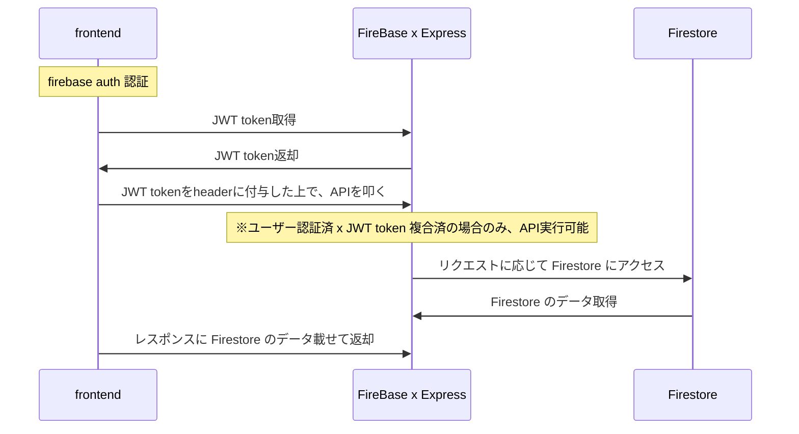

# j_template_firebase-functions

## 概要

本リポジトリは、[Firebase Cloud Functions](https://firebase.google.com/docs/functions)をベースにしたバックエンド開発テンプレートです。  
Express / TypeScript で構築してきましたが、スケールしやすさ・改修しやすさを鑑みて、[NestJS](https://nestjs.com/)への移行します。

## 目次

- [フロー図](#フロー図)
- [コマンド](#コマンド)
- [環境変数](#環境変数)
- [ロガー](#ロガー)
- [参考リンク](#参考リンク)

### フロー図

### コマンド

| コマンド                                   | 内容                                                                                                  |
| ------------------------------------------ | ----------------------------------------------------------------------------------------------------- |
| exp:start                                  | 利用しません。                                                                                        |
| exp:start:dev                              | 利用しません。                                                                                        |
| exp:start:prod                             | 利用しません。                                                                                        |
| exp:build                                  | 利用しません。                                                                                        |
| exp:test:u                                 | 利用しません。                                                                                        |
| exp:test:i                                 | 利用しません。                                                                                        |
| fb:build                                   |                                                                                                       |
| fb:build:watch                             |                                                                                                       |
| fb:serve                                   | ローカルで firebase functions を実行します。                                                          |
| fb:shell                                   |                                                                                                       |
| fb:start                                   |                                                                                                       |
| fb:deploy                                  |                                                                                                       |
| fb:logs                                    |                                                                                                       |
| format                                     |                                                                                                       |
| typedoc                                    | typedoc によるドキュメントを生成します。                                                              |
| clean:cache                                | node キャッシュをクリアします。                                                                       |
| ------------------------------------------ | ---------------------------------------------------------------                                       |
| npx firebase deploy                        | express をコンパイルした上で、firebase functions にデプロイする。ルートプロジェクトで実行する必要あり |
| npx firebase functions:secrets:get HOGE    | Secret Manager の HOGE を取得する                                                                     |
| npx firebase functions:secrets:set HOGE    | Secret Manager に変数名 HOGE で登録する                                                               |
| npx firebase functions:secrets:access HOGE | Secret Manager の HOGE の内容表示する                                                                 |

### 環境変数

本テンプレートは下記の構成を想定しています。

- ローカル開発（`npm run fb:serve`）: .env に firebase の機密情報を含めて、開発する
  - **ただし、.env ファイルは絶対にリポジトリに含めない事！**
  - [環境構成からの移行 | firebase](https://firebase.google.com/docs/functions/config-env#migrating_from_environment_configuration)にも記載されている通り、機密情報を利用する時は.env ではなく、.secret.local を利用するべきです。しかし、2023.01.21 時点で .secret.local をプロジェクトが正しく読み込めなかったため、一旦 .env を利用しています。（調査中）
- デプロイ時: [Secret Manager API](https://cloud.google.com/secret-manager?hl=ja)に登録した Secret 情報を利用する
  - functions/src/index.ts で各 API ごとに利用する機密情報を `.runWith({ secrets: ['HOGE'] })` で指定しています。
  - 機密情報を Secret Manager API に登録するには `npx firebase functions:secrets:set HOGE` コマンドを使います

### ロガー

ロガーには `functions.logger.info` を利用します。

## 参考

- Express
  - [res.locals](https://expressjs.com/en/api.html#res.locals)
  - [【Express】next()で次のミドルウェアに変数を渡したい](https://nullnull.dev/blog/how-to-pass-variables-to-the-next-middleware-using-next-in-express-js/)
  - [[Node.js][Express]リクエストからパラメータを取得する・POST されたデータを取得する](https://tech.chakapoko.com/nodejs/express/params.html)
- Firebase
  - [firebase 公式リファレンス](https://firebase.google.com/docs/reference)
    - [firebase 環境構成](https://firebase.google.com/docs/functions/config-env)
    - [firebase と環境変数ファイルの設定について](https://firebase.google.com/docs/functions/config-env#env-variables)
  - [Firebase サービスアカウントの秘密キーが解析されない問題の解決法](https://zenn.dev/kenta0313/articles/4793935e820b6c)
  - [functions:secrets:set が追加され、Functions の config を使った環境変数が非推奨になった話](https://zenn.dev/isamua/articles/firebase-functions-environment-variables)
  - [Firebase Functions から Secret Manager を使う](https://shiodaifuku.io/articles/2f33aba0-ede6-42e8-88a7-eca7b32d9caa)
  - [path alias を使った Typescript ファイルを tsc でコンパイルする](https://sunday-morning.app/posts/2020-11-13-path-alias-typescript-tsc)
  - [Firebase Functions で Secret Manager を利用する](https://zenn.dev/nbstsh/scraps/a2135438f0a89c)
- Axios
  - [axios で Bearer トークンを簡単に設定したい。](https://qiita.com/hirohero/items/8199cda2fada7432887e)
